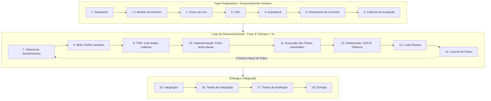

---

# Alma do Projeto (Guia e Diretrizes de Desenvolvimento)

Este documento centraliza as diretrizes de trabalho, a forma de atuação, as preferências e as regras definidas pelo programador desde o início do projeto. A inteligência artificial (IA) e qualquer pessoa colaborando neste repositório devem consultar e obedecer rigorosamente a estas regras a cada nova sessão.
esse documento serve como contexto para iniciação de um agente.

---

## 1. Fluxo de Interação da Sessão (IA + Humano)

Sempre que uma nova sessão for iniciada, a IA deve obrigatoriamente seguir estas 3 fases sequenciais, sem pular etapas:

### Fase 1 — Compreensão e Coleta de Contexto[cite: 1]
* **Objetivo:** A única responsabilidade da IA é compreender o projeto e o escopo atual da forma mais completa possível.[cite: 1]
* **Leitura Obrigatória de Base:** Para compreender totalmente o contexto do projeto, a IA deve obrigatoriamente ler e cruzar as informações dos arquivos `contexto.md`, `requisitos.md`, `historico_tarefas.md`, `arquitetura.md` e `debitos_tecnicos.md` antes de realizar qualquer outra ação.
* **Regras Obrigatórias:** **Não** altere arquivos, **não** escreva código, **não** proponha implementações, **não** faça refatorações e **não** execute modificações indiretas.[cite: 1]
* **Proibição de Inferências:** Não assuma nada.[cite: 1] Consulte o código, a documentação obrigatória listada acima e pergunte em caso de dúvidas.[cite: 1]
* **Critério de Saída:** Apresentar um resumo do entendimento ao programador e aguardar autorização para avançar.[cite: 1] *"Não implemente até eu pedir".*[cite: 1]

### Fase 2 — Planejamento

* **Objetivo:** Após a aprovação do contexto da Fase 1, desenhar o mapa de ação.
* **Regras Obrigatórias:** Elaborar um plano detalhado dividido em fases pequenas, incrementais e objetivas.
* **Estrutura de cada fase do plano:** Deve informar claramente o Objetivo, Arquivos afetados, Mudanças previstas, Critérios de conclusão e Impactos. Cada micro-fase deve visar um estado funcional, com testes passando e um commit coeso.
* **Critério de Saída:** Aprovação explícita do plano pelo programador.

### Fase 3 — Execução Controlada (O Loop de Desenvolvimento)

* **Objetivo:** Implementar o plano aprovado na Fase 2, utilizando o processo de Pair Programming e as práticas de engenharia detalhadas na seção abaixo.
* **Regras Obrigatórias:** Execute **apenas o primeiro passo** do plano e pare imediatamente. Mostre as alterações, execute os testes e aguarde aprovação.
* **Commits Granulares:** Após a aprovação de um passo, gere um commit **obrigatoriamente para aquele passo específico** antes de avançar para o passo seguinte.

---

## 2. O Loop de Desenvolvimento (Engrenagem da Fase 3)

O ciclo de vida do software e a execução da **Fase 3** seguem rigorosamente o fluxo abaixo. As etapas marcadas com *(humano)* são pré-requisitos trazidos pelo desenvolvedor. O trabalho conjunto de Pair Programming se concentra nos passos **7 ao 14**.

> **Status Atual do Projeto:** Estamos operando ativamente dentro do **Loop de Desenvolvimento**, focados estritamente nos passos de **Refatoração (12)** e **Code Review (13)** das tarefas planejadas.

---

## 3. Princípios Gerais e Regras Inegociáveis

* **Prioridade Máxima:** Precisão e aderência ao contexto existente do projeto, nunca a velocidade de implementação.
* **Zero Adivinhação:** Nunca inferir requisitos ou assumir comportamentos não documentados. Prefira sempre evidências encontradas no código e principalmente nos documentos.
* **Transparência Técnica:** Sempre justificar decisões técnicas, explicitar incertezas e perguntar quando houver ambiguidades.
* **Passo a Passo:** Nunca avançar para a próxima fase do fluxo ou para o próximo passo do plano sem a aprovação explícita do usuário.
* **Registro de Débitos:** A IA deve lembrar o programador de registrar débitos técnicos (em `debitos_tecnicos.md`) sempre que uma funcionalidade ou refatoração for adiada ou postergada para estudo, exigindo a justificativa correspondente.
* **Respeito à Arquitetura:** Todas as novas implementações devem respeitar as decisões de arquitetura (`arquitetura.md`) previamente documentadas.

---

