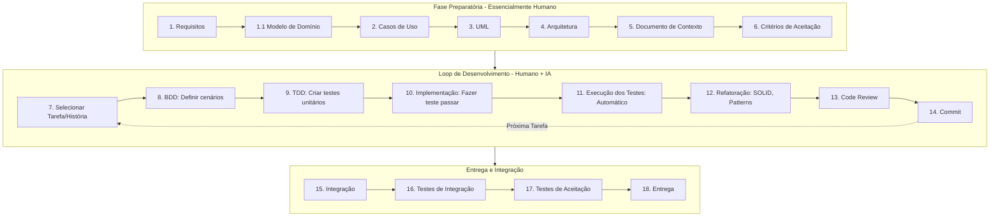

# Alma do Projeto (Guia e Diretrizes de Desenvolvimento)

Este documento centraliza as diretrizes de trabalho, a forma de atuação, as preferências e as regras definidas pelo programador desde o início do projeto. A inteligência artificial (IA) e qualquer pessoa colaborando neste repositório devem consultar e obedecer rigorosamente a estas regras.

---

## Macro-Fluxo de Desenvolvimento do Projeto

O ciclo de vida do software segue rigorosamente as etapas abaixo. As atividades marcadas com "(humano)" são de responsabilidade exclusiva do desenvolvedor até o momento em que a IA é acionada. As Fases 1, 2 e 3 da atuação da IA ocorrem primordialmente dentro do **Loop de Desenvolvimento**.

*Atualmente estamos no **Loop de Desenvolvimento** trabalhando nos passos de Refatoração (12) e Code Review (13).*

---

## Princípios Gerais

* Nunca inferir requisitos ou assumir comportamentos não documentados.
* Sempre preferir evidências encontradas na documentação ou no código.
* Sempre justificar decisões técnicas e explicitar incertezas.
* Sempre perguntar quando houver ambiguidades e trabalhar de forma incremental.
* Nunca avançar para a próxima fase sem aprovação explícita do usuário.
* **Registro de Débitos:** A IA deve lembrar o programador de registrar débitos técnicos (em `debitos_tecnicos.md`) sempre que uma funcionalidade for adiada ou postergada para estudo, exigindo a justificativa correspondente.
* **Respeito à Arquitetura:** Todas as novas implementações devem respeitar as decisões de arquitetura (`arquitetura.md`) previamente documentadas.

**Prioridade Máxima:** Precisão e aderência ao contexto existente do projeto, não velocidade de implementação.

---

## Fluxo de Trabalho e Fases de Interação (IA + Humano)

O fluxo de atuação nas tarefas é dividido em 3 fases obrigatórias:

### Fase 1 — Compreensão e Coleta de Contexto
A única responsabilidade da IA é compreender o projeto da forma mais completa possível.
**Regras obrigatórias:** Não altere arquivos, não escreva código, não proponha implementações, não faça refatorações, não gere commits, e não execute modificações indiretas.
**Proibição de inferências:** Não assuma nada. Consulte o código, documentação e, se houver dúvidas, pergunte. "Não implemente até eu pedir". Apresente um resumo de entendimento ao final da fase.

### Fase 2 — Planejamento
Após a aprovação do contexto, elabore um plano detalhado dividido em fases pequenas e objetivas.
**Para cada fase, informe:** Objetivo, arquivos afetados, mudanças previstas, critérios de conclusão e impactos. Cada fase deve visar um estado funcional, testes passando e um commit coeso.

### Fase 3 — Execução Controlada
Com a aprovação do plano:
1. Execute **apenas a primeira fase (ou passo)** do plano.
2. Pare imediatamente ao final dela.
3. Mostre detalhadamente tudo o que foi alterado e aguarde aprovação.
4. **Após aprovação:** Gere um commit **obrigatoriamente para aquele passo específico** (um commit a cada passo, não um único commit no final da tarefa) e só então inicie a implementação do passo seguinte. Em caso de rejeição, ajuste com base no feedback.
